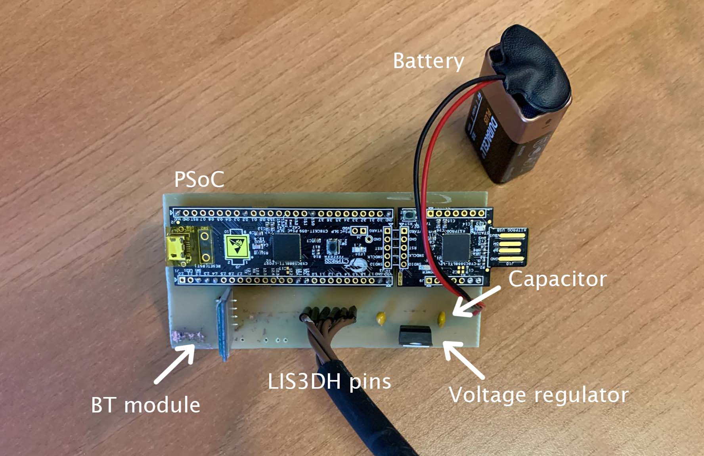
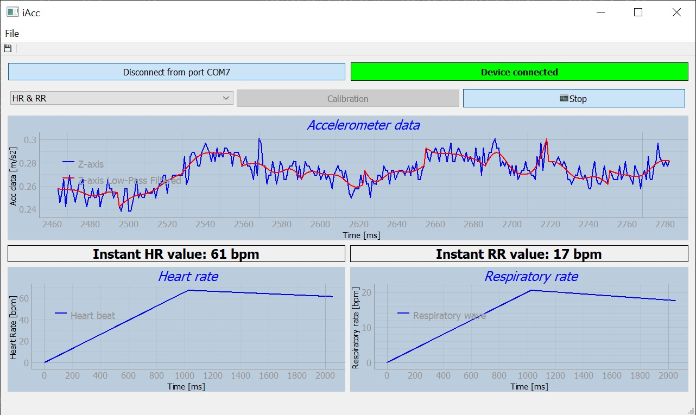

# Electronic Technologies and Biosensors Laboratory

## Academic Year 2021/2022 - II Semester

## Final Project - Project 4 - Respiratory/Heart Rate Monitor

## Objective

In this project, the aim was to develop a simple **Respiratory/Heart Rate Monitor** based on the PSoC and a 3-axis accelerometer LIS3DH. The device implements an algorithm for respiratory and heart rate computation, and then it allows data visualization on a custom GUI. PSOC and PC communication relies on a HC-05 BT Module either to make the device wearable and to reduce the cable bulkyness.
The PSoC communicates with the LIS3DH thanks to I2C communication, to acquire data at the best full-scale range possible, which has been set to $\pm 2G$, and with sampling frequency of 50 Hz.  
Finally, the whole PCB is powered thanks to a 9V battery, which allows the device to be portable and light. 

In the following image, the device is shown: 

## Repository structure

### Design files

This folder contains all the projects used to model and 3D print the case and the chest mount for the sensor, along with the Eagle files, used to design the PCB. 

### Documentation

This folder contains the literature analysed during the development of the project, while the *Datasheets* folder contains all the datasheets for the components with some other useful files. 

### GUI

The GUI folder contains all the files necessary to run the graphical interface, which is the following:

The *device search* button enables the automatic scan of all the serial ports, looking for the device. As soon as it finds it, the connection is established and the box on the right becomes green, confirming the operation. The *combobox* allows to choose to read both HR and RR or only one of them. Calibration must be performed the first time that the device is worn, so that the algorithm computes the proper threshold to detect the rates. Once calibration is over (1 min approx.), the algorithm starts to accumulate data and to calculate the peaks from the signal, in order to compute RR and HR.

The *file* button allows to export the data in a `.csv` file. This operation will be automatically performed if the device is suddenly disconnected, so that the data is not lost. 

Heart Rate and Respiratory Rate are computed on non overlapping recording windows of 30s. Raw data are filtered and analysed in two different way for the computation of the rates. 

### Heart Rate computation

First, the absolute value of recorded data is filtered by a butter bandpass filter of the 4th order with frequency range in [1 ,5]Hz. The resulting signal is then smoothed first by a Savitzky-Golay filter of the 3rd order with window length of 15 samples and then by a moving average. These steps provide a resulting waveform that crearly shows the heart beats while being quite robust against noise.  
The next step provides the threshold as the 80% of the average of the data. The algorithm looks for the peaks above the calculated threshold that are at least 25 samples apart, that correspond to 0.5s approx.  
Finally, the Heart Rate is computed as the fraction between the number of peaks in the recorded window and the length of the window in seconds. This value is updated every 30s approx.

### Respiratory Rate computation

The computation of the Respiratory Rate requires different filtering of the signal.  
First, recorded data go through a butter lowpass filter of the 5th orded with cutoff frequency of 3Hz. This filtered signal is then smoothed by a Savitzky-Golay filter with a window of 31 samples and 3rd order. The threshold is calculated in the same way as in the HR computation, but the peaks are searched every 50 samples. 
The Respiratory Rate is calculated in the same way as the Heart Rate.

### Images

Images used for this `readme` file.

### PSoC

The *PSoC Code* folder contains all the files used to program the PSoC: in particular, all the functions and variables have been reordered in the proper file, allowing to increase the main.c file readibility.  
This code basically sets the proper configuration for the accelerometer registers at startup, making it ready for the data acquisition. All the different phases are managed thanks to a UART, that enables the different operations, according to the signals that come from the GUI. So, at the beginning the accelerometer is set and ready, once the PSoC receives the *start* signal from the GUI it begins to acquire data and to transmit them.  

Regarding the data acquisition, as previously mentioned the accelerometer has been set to a sampling frequency of 50 Hz, according to the Shannon's theorem and to the literature. In addition to that, the accelerometer operates in **FIFO mode**, so it accumulates all the samplings in the FIFO register (which contains up to 32 samples) and then it stops getting new data until the register has been emptied, allowing to reduce the computational load on the CPU and so the battery consumption, with respect to **bypass** mode, that sends the data in a continuous stream.  
In order to read the FIFO register, the PSoC checks regularly the value of the *overrun bit*, that becomes 1 once the FIFO register is full and returns to 0 when it has been entirely read.  
Once the `ovrn bit` changes to one, the register is entirely read, storing the data in the respective axis array. Then, the data is packed in one single array and sent via UART.

*Further implementation details can be found in each file.*

## Complete hardware list

- 1 PSoC CY8CKIT-059 
- 1 LIS3DH accelerometer
- 1 HC05 Bluetooth module
- 1 9V battery
- 1 9V to 5V voltage regulator 
- 6 cables for the accelerometer-PSoC communication

## How to wear the device

The 3D files for the case and the support can be found in the Design folder.
